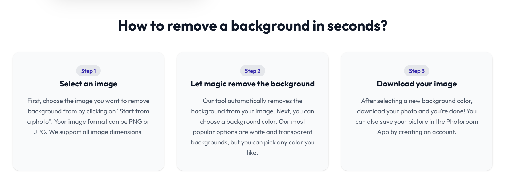

# 🎨 AI-Powered Background Removal SaaS

A full-stack Software-as-a-Service (SaaS) application that enables users to upload images and remove backgrounds using AI-powered image processing. The application integrates secure authentication, a credit-based usage model, online payments, and external AI services to deliver a seamless user experience.

> **Note:** This repository currently contains the React frontend. The Spring Boot backend powers the REST APIs, authentication, payment processing, AI integration, and database operations.

---

## 🚀 Features

* AI-powered background removal using the Clipdrop API
* Secure user authentication with Clerk JWT
* Credit-based image processing system
* Purchase additional credits through Razorpay integration
* Image upload and preview
* Responsive and modern React UI
* Real-time API integration with Spring Boot backend
* Clean and intuitive user experience

---

## 🛠️ Tech Stack

### Frontend

* React
* JavaScript
* HTML5
* CSS3
* Axios

### Backend

* Spring Boot
* Spring Security
* Spring Data JPA
* OpenFeign
* MySQL

### Authentication

* Clerk JWT Authentication

### AI Integration

* Clipdrop API

### Payments

* Razorpay

---

## ⚙️ Backend Features

The backend application provides:

* RESTful API development using Spring Boot
* JWT-based authentication and authorization using Spring Security and Clerk
* AI-powered background removal through Clipdrop API
* Credit management system
* Razorpay payment integration
* Image upload and Base64 conversion
* User credit management
* MySQL database persistence
* External API communication using OpenFeign

---

## 📂 Project Structure

```text
frontend/
├── src/
├── public/
├── package.json
└── ...
```

---

## ▶️ Getting Started

```bash
git clone https://github.com/OnkarJamdade27/ai-background-removal-saas.git
cd ai-background-removal-saas
npm install
npm run dev
```

---

## 📸 Screenshots

Add screenshots showcasing:

* Home Page


* Upload Image


* Processing 



* Payment Page


---

## 🎯 Key Learning Outcomes

* Building modern SaaS applications
* React frontend development
* JWT authentication using Clerk
* REST API integration
* AI service integration
* Credit-based business logic
* Online payment gateway integration
* Full-stack application architecture

---

## 📄 License

This project is developed for learning and portfolio purposes.
